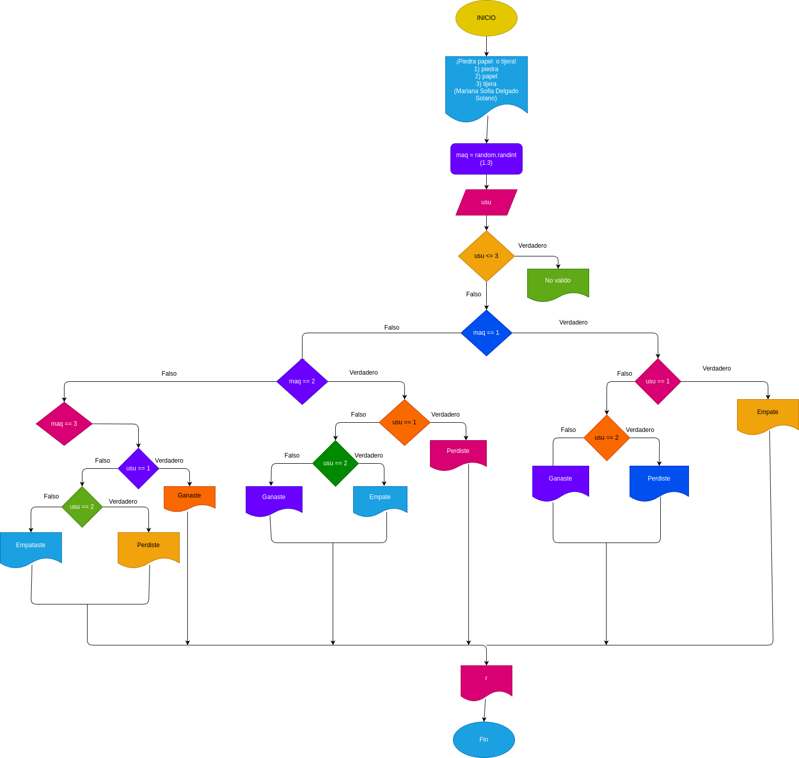

# Piedra_Papel_Tijera

# Analisis

## Input

### Variables de entrada
usu: eleccion realizada por el usuario

### processing

usu:  Determina la decision del usuario

Operaciones disponibles: 
 
 1) Piedra 

 2) Papel

 3) Tijera

 Si usu no es valido, el resultado sera "No valido".

 ### output
 usu:nDetermina la decision del usuario.

## Diseño 

